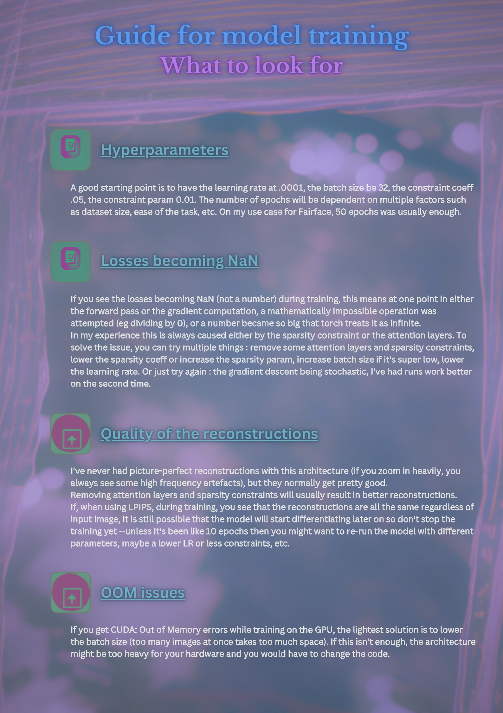

# Encoding_Fluency 
user guide (shot on a mighty slow computer): 
```html
<div style="padding:56.25% 0 0 0;position:relative;"><iframe src="https://player.vimeo.com/video/846560884?badge=0&amp;autopause=0&amp;player_id=0&amp;app_id=58479" frameborder="0" allow="autoplay; fullscreen; picture-in-picture" allowfullscreen style="position:absolute;top:0;left:0;width:100%;height:100%;" title="Untitled"></iframe></div><script src="https://player.vimeo.com/api/player.js"></script>
```


Encoding_Fluency is a package that provides a comprehensive suite of tools for training deep learning models, specifically Variational Autoencoders (VAEs), and extracting metrics from them. The package is designed with a focus on Fluence, a measure of the ease of information processing in the brain.

The package includes functionalities for developing a VAE that aligns with our needs, exploring different ways to bypass the decoder of our autoencoder, and adding a sparsity constraint to the training of our VAE to make it more biologically realistic. It also provides mechanisms for attention, and how the attention we pay to an image can indicate whether we find it beautiful or not.

The final goal of this package is to gather the development work carried out during the project into a user-friendly code interface, complete with documentation and potentially explanatory videos. 
You can check out the docs [here](https://encoding-fluence-docs.readthedocs.io/en/latest/)    


